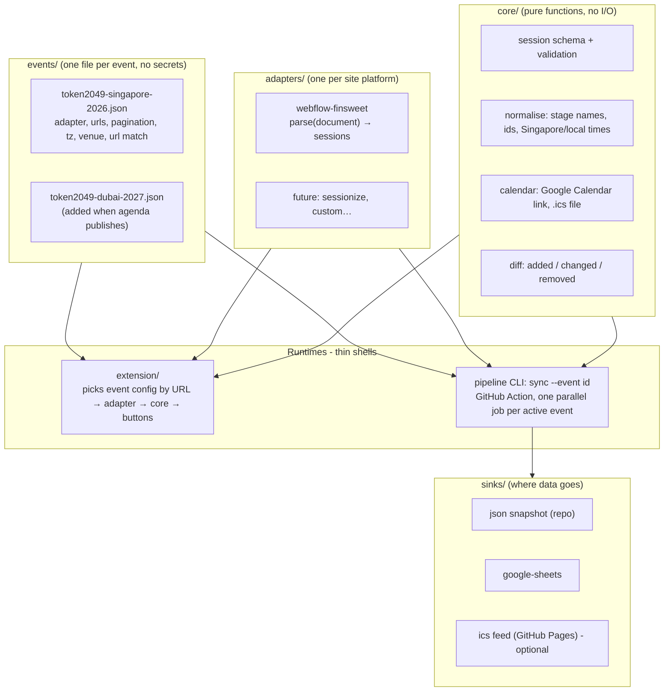

# token2049-agenda

Experimental extension to bring Token2049 talks into calendar, so you can schedule your day!


## Claude Architecture v0

Here's the architecture revised for reuse and a public repo. I checked two things first.

- **The repo has only a README** (18 bytes), so we start clean.
- **Dubai is 21–22 April 2027**, not later this year. Its agenda page already exists on the same site but has no sessions published yet. That means I can't confirm it will use the same page layout, so the design treats each new event as a config file first, and only needs new parsing code if the layout changes.

## Three levels of reuse

| Situation | What you add | Code changes |
|---|---|---|
| Next TOKEN2049 event (Dubai) | One event config file | None, if the layout matches Singapore |
| Another conference built the same way (Webflow site with the same list plugin) | One event config file | None |
| A conference built differently | One new parser module plus a config file | That parser only; nothing else changes |

## Architecture



## How the parts fit

- **`core/` holds all shared logic, written once.** That covers the session format, stage-name normalisation, IDs, calendar links, `.ics` building and diffs. The extension and the pipeline both import it, so nothing is duplicated.
- **`adapters/` parse a page into sessions.** The interface is `parse(document, config) → RawSession[]` and nothing else. The trick is that the same parser code runs inside the extension against the live page, and in the pipeline against a simulated browser page (`linkedom`). One parser serves both, so they can't drift apart.
- **`events/*.json` describes each event as data.** For example:

  ```json
  { "id": "token2049-singapore-2026", "adapter": "webflow-finsweet",
    "match": "token2049.com/singapore/agenda*",
    "pages": { "url": "https://token2049.com/singapore/agenda", "param": "630073d5_page" },
    "timezone": "Asia/Singapore", "venue": "…", "active": true }
  ```

  The page-number parameter (`630073d5_page`) is generated by Webflow for each list, so Dubai's will almost certainly differ. That's exactly why it lives in config rather than in code.
- **`sinks/` handle output, each one independent.** The sheets sink writes one tab per event (or one sheet per event; you choose). The optional `.ics` feed sink gives you a calendar you subscribe to once, and it picks up agenda changes without any OAuth. The catch is that Google refreshes subscribed calendars on its own schedule, which can take many hours.
- **The extension's site permissions are generated from the event configs.** Adding an event config file and rebuilding is all it takes for the extension to work on that event's page.
- **The GitHub Action runs every config marked `active: true` as a parallel job** (a job matrix). Ended events get switched off with `active: false`.

## Keeping a public repo secret-free

- **No Google key at all, via keyless sign-in.** The Action authenticates to Google using Workload Identity Federation (`google-github-actions/auth`), so no service-account key file ever exists to leak. The fallback, if you'd rather not set that up, is a key stored as a GitHub Actions secret.
- **Sheet IDs go in Actions variables, not the code.** They aren't strictly secret, but there's no reason to publish them.
- **The extension holds no secrets by design.** It only reads the page and builds links.
- **Guardrails:**
  - Turn on GitHub secret scanning and push protection (free for public repos).
  - Add a gitleaks check on every PR.
  - `.gitignore` covers `.env*` and a `credentials/` folder.
  - The workflow's GitHub token gets the minimum permissions: write access to commit snapshots, nothing more.
  - Sync runs only on the schedule or a manual trigger, never on pull requests from forks.

## Success metrics (added to the earlier ones)

1. **Adding an event needs no code.** I'll prove it by making a second config pointing at a copy of the Singapore page with a different ID. Both run in the Action matrix, and the code diff is 0 files outside `events/`.
2. **One parser, both runtimes.** The same adapter test fixture (saved Singapore HTML) gives identical output in the pipeline's simulated page and in the extension's real one.
3. **Clean repo.** gitleaks finds 0 issues, and no Google credentials appear anywhere in the git history.
4. **Core is pure and tested.** The calendar-link and `.ics` builders have unit tests checking the Singapore-time conversion.

## Decisions Made

1. **Calendar mode:** add-only links, the subscribed `.ics` feed for auto-updates, or both? Both -> since neither needs OAuth.
2. **Google sign-in:** keyless (Workload Identity Federation, recommended, about 15 minutes of one-time Google Cloud setup on your side) or a key stored as a GitHub secret?

Sources:
- [GitHub repo: DeveloperAlly/token2049-agenda](https://github.com/DeveloperAlly/token2049-agenda)
- [TOKEN2049 Dubai agenda page](https://token2049.com/dubai/agenda)
